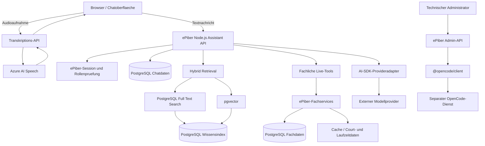
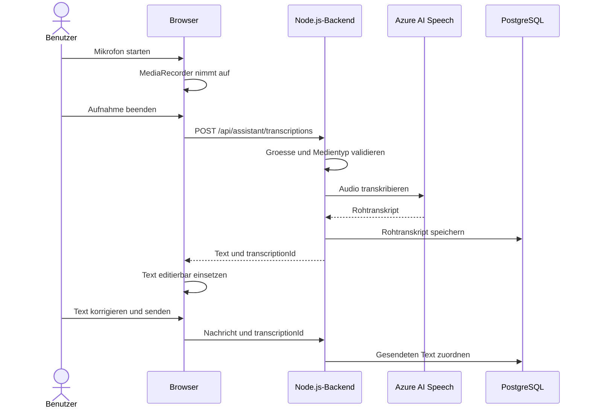
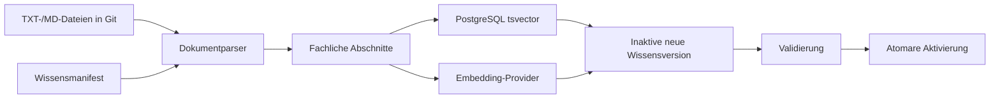
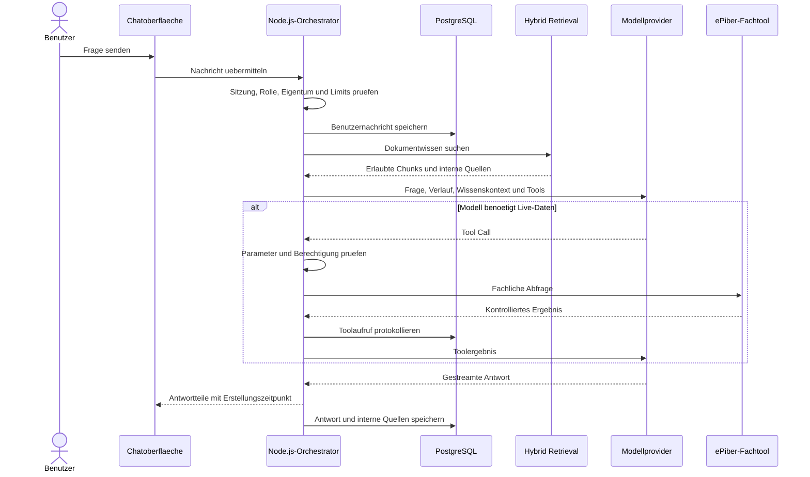
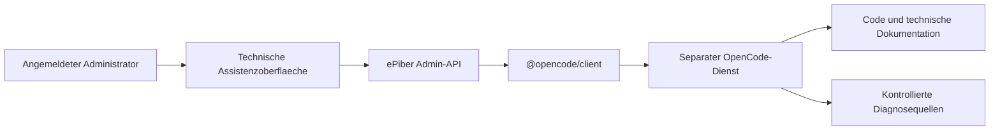

# Chat-Assistent mit Hybrid- und Vector-RAG

Stand: 23.09.2026
Status: Nicht-kanonische fachliche und technische Arbeitsgrundlage; noch nicht
implementiert, freigegeben oder als verbindliche Sollarchitektur dokumentiert
Gegenstand: Benutzerassistent mit Spracheingabe, versioniertem Fachwissen,
kontrollierten Live-Daten-Tools und optional getrennter OpenCode-Administration

Diese Datei ist eine nicht-kanonische Arbeitsgrundlage unter `Project/2do/`.
Sie konserviert den aktuellen Planungsstand fuer die spaetere schrittweise
Ausarbeitung und Umsetzung. Verbindliche fachliche Anforderungen, API-, Daten-,
Sicherheits- und Betriebsvertraege werden erst vor freigegebenen
Umsetzungsschritten in die dafuer vorgesehenen kanonischen Dokumente uebernommen.

Die in Abschnitt 24 aufgefuehrten Entscheidungen bleiben offen, soweit diese
Arbeitsgrundlage sie nicht ausdruecklich bereits festlegt. Insbesondere nimmt
dieses Dokument noch keine Auswahl des Chat- oder Embedding-Modells, der ersten
Live-Tools oder des Streamingformats vorweg.

## 1. Zielbild

ePiber erhaelt zwei voneinander getrennte KI-Anwendungsfaelle:

1. **Fachlicher Benutzerassistent**
   - beantwortet Fragen zur Plattform und zum Spielbetrieb;
   - verwendet die versionierte Fachdokumentation;
   - kann kontrolliert auf aktuelle Live-Daten zugreifen;
   - unterstuetzt Spracheingabe ueber Azure AI Speech;
   - protokolliert Gespraeche und Transkripte zur Qualitaetssicherung.
2. **Technischer Administrationsassistent**
   - basiert optional auf OpenCode;
   - dient der Code-, Fehler- und Systemanalyse;
   - ist nur fuer Administratoren zugaenglich;
   - bleibt technisch und berechtigungsseitig vom Benutzerassistenten getrennt.

Der Benutzerassistent wird als leichtgewichtiger Node.js-Orchestrator mit einem
providerunabhaengigen AI-SDK umgesetzt. OpenCode ist fuer ihn nicht erforderlich.

## 2. Gesamtsystem



Die kuenftige Persistenzgrundlage ist PostgreSQL. Neue Chat-, Wissens- und
Transkriptionskomponenten werden nicht mehr fuer SQLite geplant.

## 3. Komponenten und Verantwortlichkeiten

### 3.1 Chatoberflaeche

Die Chatoberflaeche wird Bestandteil des bestehenden Vanilla-JavaScript-
Frontends. Sie bietet:

- eine Liste vorhandener Unterhaltungen;
- das Anlegen einer neuen Unterhaltung;
- ein Texteingabefeld und einen Senden-Button;
- einen Mikrofonbutton;
- sichtbare Aufnahme- und Transkriptionszustaende;
- eine gestreamte Assistentenantwort;
- den sichtbaren Erstellungszeitpunkt jeder Nachricht und Antwort;
- Fehlermeldungen ohne technische Interna.

Quellen werden dem Benutzer nicht angezeigt. Die zur Antwort verwendeten
Dokument-Chunks und Live-Tools werden ausschliesslich intern protokolliert. Eine
sichtbare Quellenliste waere fuer den normalen Nutzungskontext zu viel
Information.

Es gibt vorerst keine Bewertung wie `hilfreich` oder `nicht hilfreich` und keine
sonstige Feedbackfunktion. Solange ein solches Feedback nicht fachlich
ausgewertet wird, werden weder Oberflaeche, Endpoint noch Persistenz dafuer
vorgesehen.

Bei Antworten mit Live-Daten wird kein separater Live-Datenstand angezeigt. Der
Zeitstempel der Antwort gilt als fuer den Benutzer ausreichende zeitliche
Einordnung. Zwischen Datenabfrage und sichtbarer Antwort darf eine technisch
bedingte Abweichung von einigen Sekunden oder geringfuegig mehr liegen. Intern
bleiben Toolzeitpunkt, Dauer und gegebenenfalls Datenrevision fuer Diagnose und
Nachvollziehbarkeit erfassbar.

### 3.2 Spracheingabe

Ablauf:



Zur Qualitaetssicherung werden Benutzer-ID, Namenssnapshot, Zeitpunkt,
Rohtranskript, tatsaechlich gesendeter Text, Medientyp, Aufnahmedauer, Provider
und Ergebnisstatus gespeichert. Das Audio selbst wird standardmaessig nicht
dauerhaft gespeichert.

Wenn Azure nicht erreichbar ist, bleibt die normale Texteingabe verfuegbar. Es
wird kein Browser-Sprachdienst als unkontrollierter Fallback verwendet.

## 4. Node.js-Orchestrator

### 4.1 Technische Grundlage

Als leichtgewichtige Grundlage ist Vercel AI SDK Core vorgesehen. Das SDK kann
in einem normalen Node.js-Backend ohne Vercel-Hosting eingesetzt werden und ist
nicht auf OpenAI-Modelle beschraenkt.

Voraussichtliche Pakete:

```text
ai
zod
@ai-sdk/mistral
@ai-sdk/azure
@ai-sdk/openai-compatible
pg
```

Der Orchestrator uebernimmt:

- Authentifizierung und Rollenpruefung;
- Gespraechsverwaltung und Persistenz;
- dokumentbezogenes Retrieval;
- Bereitstellung kontrollierter Tools;
- Modellaufruf und begrenzte Toolschleife;
- Streaming;
- interne Quellenzuordnung;
- Fehlerbehandlung und Observability.

### 4.2 Vorgesehene Modulgrenzen

Die konkrete Dateistruktur wird vor der Umsetzung an das bestehende Backend
angepasst. Fachlich sind mindestens folgende Verantwortungen zu trennen:

```text
assistantController       HTTP-Vertraege und Streaming
assistantService          Ablauf einer Chatnachricht
assistantRepository       Gespraeche, Nachrichten und Aufbewahrung
transcriptionService      Azure-Spracheingabe
modelProvider             Provider- und Modellauswahl
promptBuilder             kontrollierter System- und Wissenskontext
toolRegistry              rollenabhaengige Tool-Allowlist
knowledgeImporter         atomarer Wissensaufbau
documentParser/chunker    fachliche Abschnittsbildung
embeddingService          Dokument- und Query-Embeddings
retrievalService          FTS, Vector und Hybrid-Ranking
knowledgeRepository       Wissensversionen und Chunks
```

## 5. Modellprovider

### 5.1 Providerunabhaengigkeit

Chatmodell und Embedding-Modell werden getrennt konfiguriert. Moegliche
Chatprovider sind insbesondere Azure OpenAI, Mistral oder OpenAI-kompatible
Hoster fuer Open-Weight-Modelle wie Qwen.

```text
modelProvider.getChatModel()
modelProvider.getEmbeddingModel()
```

Ein moegliches Beispiel ist Qwen als Chatmodell und ein Mistral-Embedding-Modell
fuer die Suche. Ein Wechsel des Chatmodells erfordert keinen Neuaufbau des
Wissensindex. Ein Wechsel des Embedding-Modells, seiner Version, Dimension oder
Normalisierung erfordert eine vollstaendige Neuvektorisierung.

### 5.2 Modellanforderungen

Ein freigegebenes Chatmodell muss mindestens unterstuetzen:

- ausreichende deutsche Sprachqualitaet;
- Systemanweisungen;
- Tool Calling mit validierbaren Parametern;
- mehrere begrenzte Toolschritte;
- Streaming;
- ein fuer Verlauf, Wissen und Toolresultate ausreichendes Kontextfenster.

Die konkrete Capability-Matrix und die erste Modellauswahl bleiben offen.

## 6. Wissensquellen

### 6.1 Verbindliche Quelle bleibt Git

Die redaktionelle Wahrheit bleibt in den versionierten `.txt`- und `.md`-
Dateien. PostgreSQL enthaelt nur einen abgeleiteten, jederzeit reproduzierbaren
Suchindex.

Voraussichtliche fachliche Quellen sind:

```text
Project/FACHKONZEPT.txt
Project/Regelwerk/Spielbetrieb/
Project/Regelwerk/Organisation/
ausdruecklich freigegebene fachliche Abschnitte weiterer Dokumente
```

Technische Software-, Server-, Git- und Changelogdokumente gelangen nicht in den
normalen Benutzerindex.

### 6.2 Wissensmanifest

Ein versioniertes Manifest bildet die feste Quellen-Allowlist und ordnet
Dokumente Zielgruppen und Fachbereichen zu. Das Manifest enthaelt keinen zweiten
fachlichen Text und erzeugt deshalb keine parallele redaktionelle Wahrheit.

```yaml
documents:
  - id: fachkonzept
    path: Project/FACHKONZEPT.txt
    audiences: [public, player, operator, admin]
  - id: ranking-rules
    path: Project/Regelwerk/Spielbetrieb/RANGLISTE.txt
    audiences: [player, admin]
```

## 7. Dokumentimport und Chunking

### 7.1 Importablauf



Der Import wird nach relevanten Dokumentaenderungen automatisch im Deployment
oder in einem kontrollierten Importjob ausgefuehrt. Er ist kein manueller zweiter
Dokumentationsprozess.

### 7.2 Chunking-Regeln

Zuerst wird entlang der vorhandenen Dokument-, Kapitel- und
Unterkapitelstruktur geteilt. Nur zu grosse Abschnitte werden weiter zerlegt.
Ausgangswerte fuer Versuche sind 400 bis 800 Tokens pro Chunk und 50 bis 100
Tokens Ueberlappung.

Dabei gelten folgende Ziele:

- Ueberschrift und Elternueberschrift bleiben als Kontext erhalten;
- Regeln, Tabellenzeilen und zusammenhaengende Aufzaehlungen werden nicht
  willkuerlich getrennt;
- jeder Chunk besitzt eine stabile fachliche ID;
- Quellpfad, Abschnitt, Dokumentstatus und Zielgruppen bleiben erhalten;
- der Chunktext wird niemals manuell in PostgreSQL gepflegt.

## 8. Wissensversionierung

Jeder Import erzeugt eine unveraenderliche Wissensversion mit mindestens:

```text
Git-Commit
Manifest-Version
Chunker-Version
Embedding-Provider und -Modell
Embedding-Dimension
Importzeitpunkt
Dokument- und Chunkanzahl
Status building|active|failed|retired
```

Eine neue Version wird vollstaendig im Status `building` aufgebaut und
validiert. Erst danach wird der aktive Versionszeiger in einer PostgreSQL-
Transaktion umgestellt. Bei einem Fehler bleibt die bisher aktive Version
unveraendert. Alte Versionen koennen zeitlich begrenzt fuer Diagnose und Rollback
erhalten bleiben.

## 9. Hybrid Retrieval

### 9.1 Suchablauf

```text
Benutzerfrage
  -> Benutzerrolle und erlaubte Dokumentstatus bestimmen
  -> optionalen Fachbereich routen
  -> Query-Embedding mit dem Index-Embedding-Modell erzeugen
  -> PostgreSQL Full Text Search
  -> pgvector-Aehnlichkeitssuche
  -> Trefferlisten zusammenfuehren
  -> Duplikate entfernen und Kontext ergaenzen
  -> beste Chunks an den Orchestrator uebergeben
```

### 9.2 Metadatenfilter

Bereits die Suche beschraenkt auf:

- die aktive Wissensversion;
- die Zielgruppe des angemeldeten Benutzers;
- zugelassene Dokumentstatus;
- freigegebene Dokumentkategorien;
- gegebenenfalls den vorgerouteten Fachbereich.

### 9.3 Volltextsuche

PostgreSQL Full Text Search verwendet eine geeignete deutsche Konfiguration.
Titel und Ueberschriften werden hoeher gewichtet als Fliesstext.

### 9.4 Vektorsuche

`pgvector` speichert Embeddings fester Dimension. Dokument- und Query-Embeddings
muessen aus demselben Vektorraum stammen. Fuer die Aehnlichkeit ist zunaechst
Cosine Distance vorgesehen. Ein HNSW-Index kann zu Versuchszwecken angelegt
werden, ist bei einem kleinen Bestand aber noch keine Leistungsvoraussetzung.

### 9.5 Zusammenfuehrung

FTS- und Vektorscores werden nicht unmittelbar gleichgesetzt. Als erster Ansatz
ist Reciprocal Rank Fusion vorgesehen. Beispielhafte Versuchswerte sind je 20
FTS- und Vektorkandidaten sowie 5 bis 8 zusammengefuehrte Chunks im Modellkontext.
Die Werte werden anhand eines festen Fragenkatalogs gemessen und angepasst.

## 10. Wissenszugriff im Orchestrator

Vor dem ersten Modellschritt fuehrt das Backend verpflichtend ein Hybrid-
Retrieval fuer die Benutzerfrage aus. Zusaetzlich kann dem Modell das
rollenbeschraenkte Tool `searchKnowledge` fuer eine praezisierte Nachsuche zur
Verfuegung stehen.

Das Modell darf dokumentierte Regeln nicht durch allgemeines Modellwissen
ersetzen. Bei unzureichender oder widerspruechlicher Quellenlage muss es die
fehlende gesicherte Information kenntlich machen. Arbeitsannahmen und offene
Punkte duerfen nicht als bestaetigte Regeln formuliert werden.

## 11. Live-Daten-Tools

Live-Daten und personenbezogene Laufzeitdaten werden nicht in den Vektorindex
aufgenommen. Sie werden bei Bedarf aktuell ueber kontrollierte Fachservices
abgefragt.

Moegliche erste read-only Tools sind:

```text
getCompetitions
getCompetitionDetails
getOpenMatches
getCompletedMatches
getMyMatches
getMyRankingChallenges
getRanking
getLiveScores
getMyHallTimeReservations
getHallTimeAvailability
```

Es gibt kein allgemeines `executeSql`-, Tabellen- oder Shelltool. Das Modell
waehlt nur ein fachliches Werkzeug und seine geschlossenen Fachparameter. Die
Identitaet des Benutzers stammt ausschliesslich aus der serverseitigen Sitzung
und wird nicht als vom Modell waehbarer Parameter angeboten.

Jede Toolantwort ist eine kontrollierte Projektion mit nur erforderlichen
Fachfeldern. Interne Spaltennamen, Secrets und unnoetige Personendaten bleiben
ausgeschlossen. Die erste Ausbaustufe bleibt read-only; Chataktionen mit
Fachwrites sind nicht Bestandteil dieses Planungsstands.

## 12. Orchestrierungsablauf



Die Zahl der Modell- und Toolschritte wird begrenzt, beispielsweise auf maximal
vier Schritte. Die konkrete Grenze bleibt anhand der Versuche festzulegen.

## 13. Interne Quellenzuordnung

Das Modell erhaelt Wissens-Chunks mit serverseitig vergebenen internen
Quellenkennungen. Diese Kennungen werden nach der Antwort gegen den tatsaechlich
bereitgestellten Kontext validiert.

Intern werden mindestens gespeichert:

- verwendete Chunk-IDs;
- Dokument-ID und Abschnitt;
- Wissensversion und Git-Commit;
- verwendete Live-Tools;
- Toolzeitpunkte und Ergebnisstatus;
- gegebenenfalls kontrollierte Fachobjekt-IDs und Datenrevisionen.

Diese Informationen dienen Qualitaetssicherung und Diagnose. Sie werden nicht
als Quellenliste oder technische Detailanzeige an den Benutzer ausgegeben.

## 14. PostgreSQL-Datenmodell

### 14.1 Wissensindex

Vorgesehene logische Tabellen:

```text
assistant_knowledge_version
assistant_document
assistant_chunk
assistant_chunk_audience
```

Ein Chunk enthaelt mindestens Wissensversion, Dokument, stabile Abschnitts-ID,
Titel, Elternkontext, Inhalt, Dokumentstatus, Zielgruppen, `tsvector`,
`vector(n)`, Quellhash und Importmetadaten.

### 14.2 Gespraeche und Qualitaetssicherung

Vorgesehene logische Tabellen:

```text
assistant_conversation
assistant_message
assistant_message_source
assistant_tool_call
assistant_transcription
```

Eine Feedbacktabelle ist vorerst nicht vorgesehen.

Gespraech und Nachricht erfassen insbesondere Personen-ID, Klartext-
Namenssnapshot, Rollensnapshot, Zeitpunkte, Reihenfolge, vollstaendigen
Nachrichteninhalt, Eingabemethode, Modellprovider und -modell,
Wissensversion, Verarbeitungsstatus und kontrollierte Nutzungswerte.

Toolcalls speichern Toolname, kontrollierte Parameter, Start, Abschluss, Dauer,
Ergebnisstatus und gegebenenfalls Datenrevision. Umfangreiche freie
Toolergebnisse oder unnoetige personenbezogene Projektionen werden nicht
pauschal dupliziert.

## 15. HTTP-Schnittstellen

Voraussichtliche API:

```text
GET    /api/assistant/status
POST   /api/assistant/conversations
GET    /api/assistant/conversations
GET    /api/assistant/conversations/:id
DELETE /api/assistant/conversations/:id
POST   /api/assistant/conversations/:id/messages
POST   /api/assistant/transcriptions
```

Ein Feedbackendpoint ist vorerst nicht vorgesehen.

Die Nachrichtenantwort soll als HTTP-Stream geliefert werden. SSE, NDJSON oder
ein AI-SDK-Streamformat bleiben als konkrete Vertragsentscheidung offen.
Interne Streamzustaende koennen Start, Retrieval, Toolausfuehrung, Textteile,
Abschluss und Fehler unterscheiden; der Browser zeigt davon nur
benutzerrelevante Zustaende.

## 16. Authentifizierung und Rollen

Der Assistent verwendet die vorhandenen Secure-/HttpOnly-Sitzungscookies. Die
Rolle wird bei jedem Request aktuell serverseitig aufgeloest. Jede normale
Unterhaltung ist ihrem Benutzer zugeordnet und kann nicht durch eine frei
uebergebene Personen-ID gewechselt werden.

Ob der Chat ausschliesslich fuer angemeldete Benutzer bereitsteht, bleibt formal
offen. Die geforderte vollstaendige personenbezogene Nachvollziehbarkeit spricht
fuer eine loginpflichtige erste Version.

Administratoren duerfen die Qualitaetssicherungsdaten ueber kontrollierte
System-Schnittstellen einsehen. Eine zusaetzliche Qualitaetssicherungsrolle wird
nicht eingefuehrt. Der normale Chatvertrag darf einem Administrator nicht
automatisch die Unterhaltung eines anderen Benutzers als eigene Unterhaltung
ausgeben; administrative Einsicht ist ein getrennter Zugriffspfad.

## 17. Gespraechs- und Transkriptprotokollierung

Vollstaendig und personenbezogen gespeichert werden mindestens:

- Personen-ID;
- Klartext-Namenssnapshot;
- Rollensnapshot;
- Unterhaltungs- und Nachrichten-IDs;
- Erstellungs-, Verarbeitungs- und Abschlusszeitpunkte;
- vollstaendige Benutzerfragen;
- vollstaendige Assistentenantworten;
- Azure-Rohtranskript;
- vom Benutzer korrigierter und gesendeter Text;
- verwendetes Chat- und Embedding-Modell;
- aktive Wissensversion;
- intern verwendete Dokument-Chunks;
- aufgerufene Live-Tools und deren kontrollierte Abschlussdaten;
- Fehler- und Abbruchstatus.

Planungswert fuer die zeitliche Aufbewahrung sind ungefaehr sechs Monate. Die
exakte kalenderbezogene Loeschregel bleibt vor der Umsetzung festzulegen.

Der gesamte persistierte Bestand fuer Chats, Antworten, Quellenzuordnungen,
Toolcalls und Transkripte darf 500 MB nicht ueberschreiten. Erreicht der Bestand
diese Grenze, werden die aeltesten vollstaendigen Unterhaltungen samt abhaengigen
Datensaetzen rotiert, auch wenn ihre zeitliche Aufbewahrungsfrist noch nicht
abgelaufen ist. Zeitbasierte Bereinigung und Groessenrotation muessen
transaktional verhindern, dass verwaiste Teilinformationen verbleiben. Die
konkrete Groessenmessung, Sicherheitsreserve und Ausfuehrungsfrequenz bleiben zu
definieren.

Es werden keine eigenen Export- oder Auskunftsfunktionen fuer Benutzer oder eine
gesonderte Produktoberflaeche dafuer vorgesehen. Im Bedarfsfall greifen
Administratoren die Daten ueber kontrollierte System-Schnittstellen direkt ab.

Die Inhaltsdaten liegen in PostgreSQL und nicht als freie Inhalte in journald,
Loki oder Prometheus. Allgemeine Betriebslogs enthalten nur kontrollierte
Metadaten.

## 18. Fehler- und Degradationsverhalten

### 18.1 Embedding-Provider nicht verfuegbar

Die Vektorsuche kann kontrolliert auf Full Text Search zurueckfallen. Der
degradierte Zustand wird intern protokolliert und gemessen, ohne dem Benutzer
technische Details anzuzeigen.

### 18.2 Chatmodell nicht verfuegbar

Die Benutzernachricht bleibt gespeichert, die Antwort erhaelt einen
Fehlerstatus und kann kontrolliert erneut angestossen werden. Es wird keine
Ersatzantwort erfunden.

### 18.3 Azure Speech nicht verfuegbar

Vorhandener Eingabetext bleibt erhalten und Texteingabe funktioniert weiter. Es
wird kein automatischer Browser-Speech-Fallback aktiviert.

### 18.4 Wissensimport fehlgeschlagen

Die bisherige aktive Wissensversion bleibt unveraendert. Eine teilweise neue
Version wird nie fuer Anfragen freigegeben.

### 18.5 Live-Tool fehlgeschlagen

Das Modell darf keine Live-Daten schaetzen. Es kann weiterhin dokumentierte
allgemeine Regeln erklaeren und formuliert die fehlende aktuelle Auskunft kurz
und ohne technische Interna.

## 19. Sicherheit

Fuer den Benutzerassistenten gelten mindestens:

- keine Shell und kein allgemeines Dateisystemtool;
- kein frei formuliertes SQL;
- ausschliesslich registrierte Fachtools;
- geschlossene und validierte Toolparameter;
- Rollen- und Objektpruefung im Fachservice;
- begrenzte Modell- und Toolschritte;
- Request-, Kontext-, Antwort-, Zeit- und Ratelimits;
- keine Secrets in Prompts oder Toolresultaten;
- Dokumentinhalte gelten als Daten, nicht als ausfuehrbare Anweisungen;
- Schutztests gegen Prompt-Injection und Rollenueberschreitung;
- keine personenbezogenen Live-Daten im Vektorindex;
- keine Chatnachrichten im Wissensindex.

Fuer jede neue Backendoperation sind strukturierte Abschlusslogs sowie Daten-,
Fehler- und Datenschutzpfade gemeinsam zu pruefen. Die erste Ausbaustufe besitzt
keine Chat-Fachwrites; spaetere Schreibtools benoetigten zusaetzlich den
vollstaendigen Auditvertrag und eine ausdrueckliche Benutzerbestaetigung.

## 20. Observability

Vorgesehene strukturierte Betriebsereignisse sind beispielsweise:

```text
assistant_request_completed
assistant_retrieval_completed
assistant_tool_completed
assistant_provider_request_completed
assistant_transcription_completed
assistant_knowledge_import_completed
assistant_knowledge_activation_completed
assistant_retention_cleanup_completed
```

Erlaubte kontrollierte Felder koennen Request-ID, Personen-ID, Provider,
Modell, Wissensversion, Trefferanzahl, Toolname, Dauer, Ergebnisstatus,
Tokenverbrauch, Fehlercode und Bereinigungszaehler enthalten.

Nicht in Betriebslogs gelangen Chattext, Transkript, Dokument-Chunks,
vollstaendige Toolresultate oder API-Schluessel. Die ausdruecklich gewuenschten
Inhalte werden ausschliesslich im geschuetzten PostgreSQL-Fachbestand
persistiert.

Vorgesehene Metriken betreffen Anfrageanzahl, Antwortdauer,
Time-to-first-token, Retrievaldauer, FTS-/Vector-Treffer, Toolstatus,
Providerfehler, Tokenverbrauch, Transkriptionsdauer, Wissensimport,
Aufbewahrungsbestand und aktive Wissensversion. Browserdiagnosen benoetigen vor
Umsetzung einen bekannten Seitentyp und eine feste Event-/Feld-Allowlist.

## 21. Qualitaetssicherung

Ein fester Fragenkatalog bildet reale Formulierungen fuer Rangliste, Matches,
Bewerbe, Hallenzeiten, Rollen und Scoreboard ab. Zu jeder Frage werden intern
die erwarteten Dokumentabschnitte festgelegt.

Retrievalmessungen umfassen insbesondere:

- erwarteter Treffer in Top 1, Top 3 und Top 5;
- falsche fachliche Treffer;
- Rollen- und Statusfilterung;
- Vergleich von FTS, Vector und Hybrid-Ranking.

Antworttests pruefen Quellenbindung, korrekte Behandlung von Arbeitsannahmen,
Ausschluss technischer Informationen, fehlende Halluzinationen bei Live-Daten
und verstaendliche Fehlerpfade.

Mistral, Qwen und weitere Modelle koennen mit demselben Katalog hinsichtlich
Toolzuverlaessigkeit, Antwort- und Deutschqualitaet, Halluzinationsrate, Dauer
und Kosten verglichen werden. Es wird vorerst kein Benutzerfeedback gesammelt
oder ausgewertet.

## 22. OpenCode als getrennte Administrationsschiene

Der optionale technische Assistent verwendet:



`@opencode/client` ist der typisierte Node.js-Client fuer die OpenCode-HTTP-API.
OpenCode wird nicht mit `@opencode/sdk` in den normalen ePiber-Prozess
eingebettet.

Die Administrationsschiene besitzt keine gemeinsamen Sessions mit dem
Benutzerchat, keinen Zugriff fuer normale Benutzer, eigene Prozess- und
Berechtigungsgrenzen und standardmaessig lesende Rechte. Shell- und
Schreibzugriffe sind gesondert zu beschraenken. Chat- oder Personendaten werden
nur bei einem konkreten administrativen Diagnosebedarf einbezogen.

## 23. Empfohlene Implementierungsphasen

### Phase 1 - Grundlage

- PostgreSQL-Zielschema festlegen;
- AI SDK Core integrieren;
- Modellprovider abstrahieren;
- einfacher Textchat;
- Gespraechspersistenz und Aufbewahrungsmechanik;
- noch keine Live-Tools.

### Phase 2 - Hybrid- und Vector-RAG

- Wissensmanifest;
- Parser und Chunker;
- PostgreSQL Full Text Search;
- pgvector und Embedding-Provider;
- Hybrid-Ranking;
- interne Quellenpersistenz;
- atomare Wissensversionen.

### Phase 3 - Spracheingabe

- MediaRecorder;
- Azure AI Speech;
- Rohtranskriptpersistenz;
- Zuordnung zum korrigierten Nachrichtentext;
- Drei-Engine- sowie Android-, iPhone- und iPad-Browsertests.

### Phase 4 - Live-Daten

- ausschliesslich lesende Fachtools;
- Rollenprojektionen;
- interne Frische- und Revisionsangaben;
- Tool-Observability.

### Phase 5 - Qualitaet und Betrieb

- Retrieval-Testkatalog;
- Modellvergleich;
- Prompt-Injection- und Rollenpruefungen;
- Kosten- und Ratelimits;
- administrative Qualitaetsauswertung;
- Retention- und 500-MB-Rotationstest.

### Phase 6 - OpenCode-Administration

- separater OpenCode-Dienst;
- `@opencode/client`;
- Adminoberflaeche;
- kontrollierter Code- und Diagnosezugriff.

## 24. Offene Entscheidungen

Folgende Punkte bleiben nach dem aktuellen Planungsstand offen:

1. Ist der Chat ausschliesslich fuer angemeldete Benutzer verfuegbar?
2. Welche Rollen duerfen welche fachlichen Dokumente abfragen?
3. Welcher Modellprovider und welches Chatmodell werden zuerst verwendet?
4. Welcher Provider und welches Modell erzeugen die Embeddings?
5. Welche Embeddingdimension wird gespeichert?
6. Welche exakte kalenderbezogene Loeschregel bildet die ungefaehr
   sechsmonatige Aufbewahrung ab?
7. Wie werden die 500 MB exakt gemessen, welche Sicherheitsreserve gilt und wie
   oft laeuft die Rotation?
8. Soll die erste Version bereits Live-Daten verwenden?
9. Welche Live-Tools gehoeren zum ersten Umfang?
10. Wird HTTP-Streaming ueber SSE, NDJSON oder ein AI-SDK-Protokoll umgesetzt?
11. Wie viele und welche frueheren Nachrichten werden dem Modell uebergeben?
12. Soll ein Benutzer eigene Gespraeche selbst loeschen koennen?
13. Welche Dokumentstatus duerfen normale Benutzer sehen?
14. Wird eine neue Wissensversion direkt im Deployment oder erst nach einem
    getrennten Freigabeschritt aktiviert?
15. Welche Azure-Regionen und konkreten Ressourcen werden fuer Speech und
    gegebenenfalls Modellbetrieb verwendet?
16. Welche Aufnahmezeit, Dateigroesse und Parallelitaetsgrenze gelten fuer
    Spracheingaben?
17. Welche administrativen System-Schnittstellen werden fuer die direkte
    Einsicht in Chat- und Transkriptionsdaten verwendet?

Bewusst bereits entschieden sind: keine sichtbaren Quellen, kein
Benutzerfeedback, kein separater Live-Datenstand neben dem Antwortzeitpunkt,
keine eigene Qualitaetssicherungsrolle, keine Export-/Auskunftsfunktion, ein
Planungswert von ungefaehr sechs Monaten Aufbewahrung, eine harte
500-MB-Bestandsgrenze mit Rotation der aeltesten Unterhaltungen und eine
vollstaendige personenbezogene Protokollierung mit ID und Klartextname.

## 25. Spaetere kanonische Dokumentationsziele

Vor einer Umsetzung sind die jeweils bestaetigten Teile nach Ruecksprache in die
kanonischen Zieldokumente zu uebernehmen:

- `Project/FACHKONZEPT.txt` fuer Zweck, Benutzergruppen, Protokollierung und
  Nutzungsszenarien;
- `Project/software/ARCHITEKTUR.txt` fuer Orchestrator, Provider, Retrieval,
  Tools, Sicherheit und Observability;
- `Project/software/ENDPOINTS.txt` fuer Assistant-, Streaming- und
  Transkriptionsvertraege;
- `Project/software/DATENBANK.txt` fuer PostgreSQL-Tabellen und Beziehungen;
- eine spaeter abzustimmende Detaildokumentation fuer Wissensimport, Chunking,
  Embeddings und Hybrid-Ranking;
- eine spaeter abzustimmende Seitendokumentation fuer sichtbares Verhalten und
  Bedienung der Chatoberflaeche.
